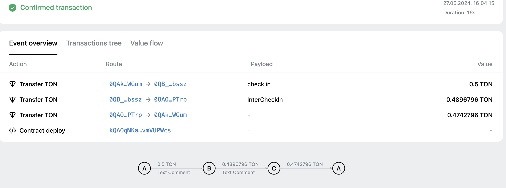

# checkin

## How to use

`npm install`

### 1. Build

`npm run build`

### 2. Test

`npm run test`

### 3. Deploy

`npm run start`  and choose the deployCheckIn.ts
testnet address： `0QBYqEFGYJjf83eimeNfU4ojLbYd8MxNjFuBKdaAuXy2RQ_N`

### 4. check in example
`npm run start`  and choose the check_in.ts

### 5. get the checkin log example
[read_example](./scripts/read_example.ts)

run: 
`ts-node ./scripts/read_example.ts`
